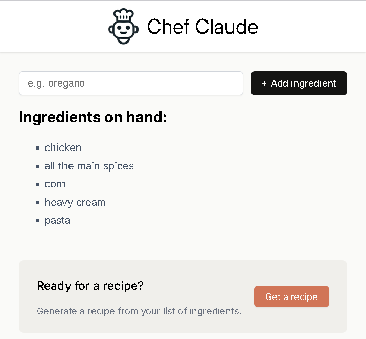

#  Chef Claude

Chef Claude is a React-based web application that helps users generate recipes based on the ingredients they have on hand. The application leverages AI models from Anthropic and Hugging Face to suggest recipes.

## Table of Contents

- [Preview](#preview)
- [Getting Started](#getting-started)
- [Features](#features)
- [Project Structure](#project-structure)
- [Dependencies](#dependencies)
- [Usage](#usage)
- [Contributing](#contributing)
- [License](#license)

## Preview

Here is a preview of the Chef Claude application:

 

## Getting Started

To get started with Chef Claude, follow these steps:

1. Clone the repository:
    ```sh
    git clone https://github.com/hamawebdev/ChefClaude
    cd ChefClaude
    ```

2. Install the dependencies:
    ```sh
    npm install
    ```

3. Start the development server:
    ```sh
    npm start
    ```

The application will be available at `http://localhost:3000`.

## Features

- **Ingredient Management**: Add and list ingredients you have on hand.
- **Recipe Generation**: Generate recipes based on the ingredients using AI models.
- **Responsive Design**: The application is designed to be responsive and user-friendly.

## Project Structure

```
ChefClaude/
├── components/
│   ├── ClaudeRecipe.jsx
│   ├── IngredientsList.jsx
├── images/
├── App.jsx
├── Header.jsx
├── Main.jsx
├── ai.js
├── index.css
├── index.html
├── index.jsx
├── package.json
├── README.md
├── recipeCode.md
├── vite.config.js
```

- **components/**: Contains React components for displaying recipes and ingredients.
- **images/**: Contains image assets.
- **App.jsx**: Main application component.
- **Header.jsx**: Header component.
- **Main.jsx**: Main content component.
- **ai.js**: Contains functions to interact with AI models.
- **index.css**: Global CSS styles.
- **index.html**: HTML template.
- **index.jsx**: Entry point for the React application.
- **vite.config.js**: Vite configuration file.

## Dependencies

- **React**: A JavaScript library for building user interfaces.
- **React DOM**: Provides DOM-specific methods for React.
- **React Markdown**: A React component to render Markdown.
- **Anthropic AI SDK**: SDK for interacting with Anthropic AI models.
- **Hugging Face Inference**: SDK for interacting with Hugging Face models.
- **Vite**: A build tool that provides a fast development server.

## Usage

1. **Add Ingredients**: Use the input field to add ingredients you have on hand.
2. **Generate Recipe**: Once you have added at least four ingredients, click the "Get a recipe" button to generate a recipe.
3. **View Recipe**: The generated recipe will be displayed in a user-friendly format.

## Contributing

We welcome contributions to improve Chef Claude. To contribute, please follow these steps:

1. Fork the repository.
2. Create a new branch (`git checkout -b feature-branch`).
3. Make your changes and commit them (`git commit -m 'Add new feature'`).
4. Push to the branch (`git push origin feature-branch`).
5. Create a pull request.

## License

This project is licensed under the MIT License. See the [LICENSE](LICENSE) file for details.
